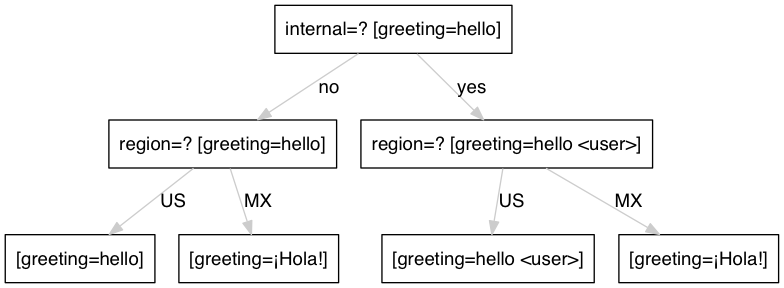

========
Concepts
========

.. 2015/11/13: initial version

Context
=======

The context is the dimension map for the given set of keys. The default context
is known as the "master" context. All keys must be listed in the "master" context.
Contexts have an order associated with them so that conflicts can be resolved by
the configuration compiler. The following is an example showing dimension
priority:

.. code-block:: yaml

   ---
   - dimensions:
     - internal
     - region

   - context: master
     greeting: hello

   - context: { internal: yes }
     greeting: hello <user>

   - context: { region: MX }
     greeting: ¡Hola!

In the above example the decision tree looks like this:

Keys
====

Keys (aka settings or properties) are main interface to a configuration and is the
set of keys it defines values for. This set of keys is well-defined, and the code
using the configuration can expect all keys to be defined for any given request.
As such, we declare the keys available from a given configuration along with its
base value to use if it isn't set for a particular request context.

All keys must be assigned a type and default value and must exist in the "master"
context. Here is an example:

.. code-block:: yaml

   ---
   - context: master
     greeting: hello world
     num_ads: 1

   - context: { product: search }
     num_ads: 4

In the above example the key types and default values are defined as:

 - greeting
   - Type: string
   - Default Value: "hello world"
 - num_ads
   - Type: integer
   - Default Value: 5

.. note:: Once defined in the "master" context a key's type cannot be modified

Primitive Types
===============

string
------

String keys represent a sequence of zero or more unicode characters. This type is
typically bound to the string or character pointer type depending on the language.
The following is an example of a configuration using strings:

.. code-block:: yaml

   ---
   - context: master
     greeting: hello world
     is_string: !!str 1

   - context: { region: australia }
     greeting: "Cheers! �"

.. note:: the "!!str" tag denotes the value is a string

integer
-------

Integer keys represent a whole number. When values are not integers but they are
cast using the "!!int" tag the value will be converted at runtime.
The following is an example of a configuration using integers:

.. code-block:: yaml

   ---
   - context: master
     num_ads: 2

   - context: { product: search }
     num_ads: !!int 4.1

.. note:: the "!!int" tag denotes the value is an integer

boolean
-------

Boolean keys represent a true/false value. The following values are mapped to "true"
and "false" respectively:

 - true
   - true
   - 1
   - yes
 - false
   - false
   - 0
   - no

Here are a few examples:

.. code-block:: yaml

   ---
   - context: master
     show_ads: no
     is_internal: true
     is_boolean: !!bool 1

.. note:: the "!!bool" tag denotes the value is a boolean

sequence
--------

Sequences (aka arrays or lists) represents a collection indexed by sequential
integers starting with zero. Care must be taken to insure that the type of the list's
values is maintained throughout all items. The contextual override behavior is to push
new elements to the back of the list. The following is an example of a
configuration using sequences:

.. code-block:: yaml
 
   ---
   - context: master
     positions:
       - ov-top
       - ov-bot
       - ov-east
     primes: [1,2,3,5,7,11,13]

   - context: { tier: FE }
     # The following appends ov-west to the end
     positions:
       - ov-west
     # The following will cause a compilation failure
     # since there is a type mismatch for the sequence
     primes:
       - seventeen

.. note:: the "!!seq" tag denotes the value is a sequence

mapping
-------

Mappings (aka maps) represent an associative container, where each key is unique in
the association and mapped to exactly one value. Depending on the language these may
be converted into Hash Maps or Classes. Contexual override behavior requires the
same structure and type. The following is an example of a configuration using
mappings with a contextual override:

.. code-block:: yaml

   ---
   - context: master
     a_mapping:
       date:
         format: 'mm/dd/yyyy'
         show_epoch: 1
     another_mapping: foo { bar: 'hello world' )

   - context: { tier: FE }
     # notice the structure of the following matches
     # the master context
     another_mapping: foo { bar: 'baz' )

.. note:: the "!!map" tag denotes the value is a mapping

Complex Types
=============

In cases where the type can not be intuited there is a need to explicitly define the
type. These are known as complex types. There are currently three complex types:

  * Hash Maps
  * Regular Expressions
  * Sets

To instruct the compiler that a value is of a specific complex type you must
provide a '!name' directive before the value appears. In the case of dynamic the
prefix must be '!!dynamic'.

Here is a simple example:

.. code-block:: yaml

   ---
   - regular-expressions:
     color: '#[0-9a-fA-F]{3}'

   - context: master
     bgcolor: !color '#fff'

In this case the above type of bgcolor is 'color' which can be either a set or a
regular expression.

This typing allows built-in validation for configurations and removed the need for
additional 'unit' testing.

Hash Maps
---------

Key values can be forced to match a hash map type where the hash map contains
a specific type. For example, all hash map values must be an integer or a string.

.. code-block:: yaml

   ---
   - context: master
     query_parameters: !!dynamic
       fr: sfp
       fr2: offsite
       n: "10"

In the above example, the query_parameters hash map contains a number of query
parameters. Notice the type of each must be the same. This list can then be
extended to include additional parameters.

The following example overrides the previous defined key 'n' with value '12' and adds a new key 'o' with value set to '10'

.. code-block:: yaml

   ---
   - context: { language: en-US }
     query_parameters:
       n: "12"
       o: "10"

Regular Expressions
-------------------

Key values can be forced to match a given regular expression. This is useful for
preventing invalid configurations from reaching production. Each regular expression
has a name which can be activated using the complex "!name" tag format.

Here is an example:

.. code-block:: yaml

   ---
   - regular-expressions:
     color: '#([0-9a-fA-F]{3}){1,2}|blue|cyan|gray|green|orange|purple|red|yellow|cream'

Then you can assign a color using the following:

.. code-block:: yaml

   ---
   - context: master
     bgcolor: !color '#fff'
     fgcolor: !color blue

When there is a failure to match a given regex for a specific value, like this:

.. code-block:: yaml

   ---
   - context: master
     bgcolor: !color '#ffg'
     fgcolor: !color blue

you will see the following error at build time:

.. code-block:: shell

   content "#ffg" did not match regular expression "color"

Regular expressions referenced into master settings, are also implicitly applied to overriden values. For example:

.. code-block:: yaml

   ---
   - context: { language: en-US }
     bgcolor: '#ffg'

Produces the same error at build time:

.. code-block:: shell

   content "#ffg" did not match regular expression "color"

Sets
----

Key values can be forced to match a value from a list of values. This is useful for
preventing invalid configurations from reaching production. Each set
has a name which can be activated using the complex "!name" tag format.

Here is an example:

.. code-block:: yaml

   ---
   - sets:
     ad_position:
       - north
       - south
       - east
       - west

Then you can assign a color using the following:

.. code-block:: yaml

   ---
   - context: master
     top_ad_position: !ad_position north
     bottom_ad_position: !ad_position south
     right_ad_position:  !ad_position east
     left_ad_position:  !ad_position west

When there is a failure to match a given regex for a specific value, like this:

.. code-block:: yaml

   ---
     top_ad_position: !ad_position upper-deck

you will see the following error at build time:

.. code-block:: shell

   content "upper-deck" did not match set "ad_position"

Type Casting
============

In some cases there might be a desire to override the type of a key. For example, if
you have a number that you would like to store as a string instead. Here are some
examples of type casting:

.. code-block:: yaml

   ---
   - context: master
     an_int: !!int 1.2
     a_boolean: !!bool yes
     a_float: !!float 1
     a_mapping: !!map date { format: 'mm/dd/yyyy', show_epoch: 1 }
     a_null: !!null NULL
     a_sequence: !!seq [1,2,3]
     a_string: !!str 1

.. note:: Since a key's type must be maintained throughout all contexts, the type must
 be defined in the master dimension.

