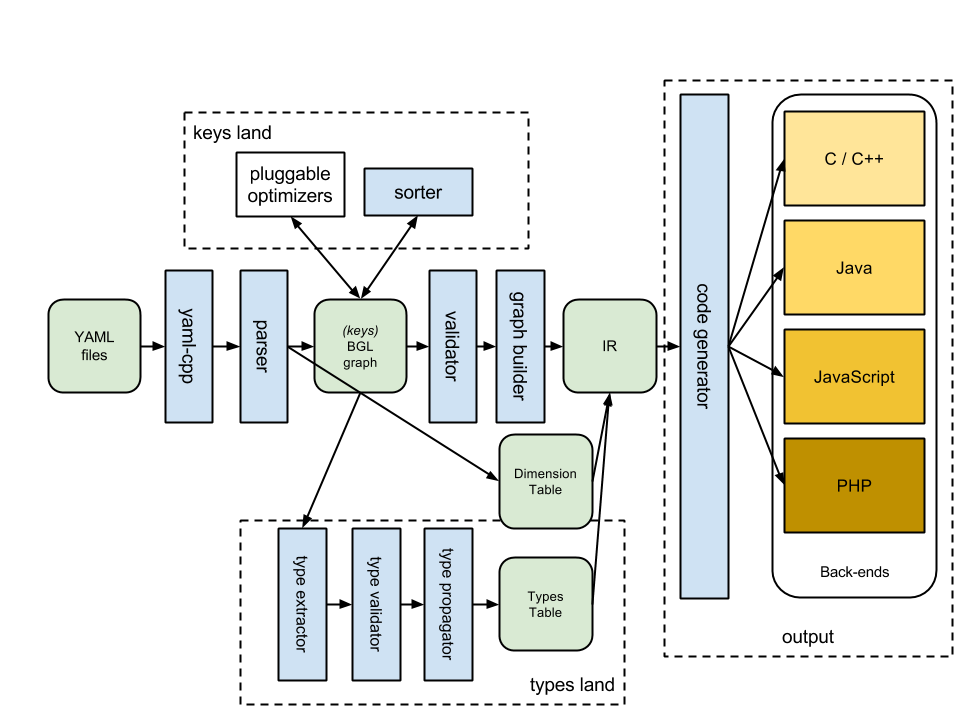

Welcome to Zeus's documentation!
================================

.. toctree::
   :maxdepth: 2

   overview
   getting_started
   concepts
   reference

About
=====

Zeus is a configuration compiler. The goal is to provide a single configuration
across multiple tiers while providing highly performant and scalable accessors
in native programming languages.

Build Status
============

.. image:: https://travis-ci.org/yahoo/zeus.svg

Source Formats
==============

Currently only YAML input formats are supported.

Target Formats
==============

Currently, the following languages are supported:
 - C++
 - Json (through C++)
 - Java
 - JavaScript
 - PHP

Build Dependencies
==================
 - C++ compiler with C++11 support
   - gcc >= 4.8
   - clang >= 3.3
 - boost >= 1.49
 - cmake
 - `yamlcpp <https://github.com/jbeder/yaml-cpp>`_ (already a submodule)

Example
=======

Given the following input configuration:

.. code-block:: yaml

   ---
   - dimensions:
     - lang

   - context: master
     date_format: YYYY.MM.DD

   - context: { lang: en-US }
     date_format: MM-DD-YYYY

   - context: { lang: pt-BR }
     date_format: DD/MM/YYYY

The following JavaScript code will be generated:

.. code-block:: javascript

   function date_format() {
      switch (this.lang) {
      case en_US:
         return "MM-DD-YYYY";
      case pt_BR:
         return "DD/MM/YYYY";
      default:
         return "YYYY.MM.DD";
      }
   };

Compiler Design
===============

Contributors
============

 - Daniel Morilha
 - Benedicto Franco Jr.
 - Marco Aurelio Carvalho
 - Scott Beardsley
 - Rodrigo Setti
 - Wooseok Jeong

License
=======

Code licensed under the BSD license. See `LICENSE <https://github.com/yahoo/zeus/blob/master/LICENSE>`_ file for terms.

